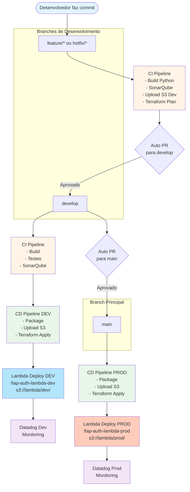

# Lambda Authentication


[](https://sonarcloud.io/summary/new_code?id=fiap-soat-grupo36_lambda-authentication)
[](https://sonarcloud.io/summary/new_code?id=fiap-soat-grupo36_lambda-authentication)
[](https://sonarcloud.io/summary/new_code?id=fiap-soat-grupo36_lambda-authentication)
[](https://sonarcloud.io/summary/new_code?id=fiap-soat-grupo36_lambda-authentication)
[](https://sonarcloud.io/summary/new_code?id=fiap-soat-grupo36_lambda-authentication)

Serviço de autenticação serverless implementado com AWS Lambda, Python 3.12 e infraestrutura gerenciada via Terraform. O projeto implementa CI/CD completo com GitHub Actions, suportando deployments separados para ambientes de desenvolvimento e produção.

## 📋 Índice

- [Arquitetura](#arquitetura)
- [Infraestrutura](#infraestrutura)
- [Pipelines CI/CD](#pipelines-cicd)
- [Fluxo de Deploy](#fluxo-de-deploy)
- [Pré-requisitos](#pré-requisitos)
- [Configuração](#configuração)
- [Estrutura do Projeto](#estrutura-do-projeto)

## 🏗️ Arquitetura

O projeto segue uma arquitetura serverless com os seguintes componentes principais:

- **AWS Lambda**: Função serverless para processamento de autenticação
- **Amazon S3**: Armazenamento de artefatos de deployment
- **AWS IAM**: Controle de acesso e permissões
- **Datadog**: Observabilidade, monitoramento e tracing distribuído
- **Terraform**: Infraestrutura como código (IaC)
- **GitHub Actions**: Automação de CI/CD

## 🚀 Infraestrutura

A infraestrutura é totalmente gerenciada via Terraform e provisiona os seguintes recursos na AWS:

### Recursos AWS

#### Função Lambda
- **Nome**: `fiap-auth-lambda-${environment}` (dev/prod)
- **Runtime**: Python 3.12
- **Handler**: `handler.lambda_handler`
- **Timeout**: 10 segundos
- **Memória**: 128 MB
- **Empacotamento**: ZIP armazenado no S3

#### IAM Role
- **Nome**: `fiap-lambda-role`
- **Política**: `AWSLambdaBasicExecutionRole`
- **Permissões**: CloudWatch Logs para execução e debugging

#### Integração Datadog
- **Layers**: Datadog Python (v119) + Extension (v86)
- **Variáveis de Ambiente**:
  - `DD_API_KEY`: Chave de API do Datadog
  - `DD_ENV`: Ambiente (dev/prod)
  - `DD_SERVICE`: fiap-auth-lambda
  - `DD_SITE`: us5.datadoghq.com
  - `DD_TRACE_ENABLED`: true

#### Rede
- **VPC**: Referencia VPC existente "fiap-oficina-mecanica"
- **Região**: us-east-2 (Ohio)

### Arquivos de Infraestrutura

```
infra/
├── backend.tf              # Backend S3 para Terraform state
├── data.tf                 # Data sources (VPC, etc.)
├── iam.tf                  # IAM roles e policies
├── lambda.tf               # Definição da Lambda function
├── providers.tf            # Provider AWS
├── variables.tf            # Declaração de variáveis
└── environments/
    ├── dev.tfvars         # Variáveis de desenvolvimento
    └── prod.tfvars        # Variáveis de produção
```

#### `backend.tf`
Configura o backend remoto do Terraform para armazenar o state no S3, permitindo colaboração em equipe e versionamento do estado da infraestrutura.

#### `variables.tf`
Define todas as variáveis parametrizáveis:
- `lambda_s3_bucket`: Bucket S3 para artefatos
- `lambda_s3_key`: Caminho do ZIP no S3
- `environment`: Ambiente de deployment (dev/prod)
- `aws_region`: Região AWS
- `datadog_*`: Configurações de observabilidade

#### `environments/*.tfvars`
Arquivos de valores específicos por ambiente, facilitando configuração multi-ambiente sem duplicação de código.

## 🔄 Pipelines CI/CD

O projeto utiliza **GitHub Actions** com workflows reutilizáveis para garantir consistência e manutenibilidade.

### CI - Integração Contínua (ci.yml)

**Jobs:**

1. **`build-python`**
   - Compila o código Python 3.12
   - Instala dependências do `requirements.txt`
   - Executa testes unitários
   - Gera relatórios de cobertura

2. **`sonarqube`**
   - Análise estática de código
   - Validação de qualidade e segurança
   - Integração com SonarCloud
   - Verifica code smells, bugs e vulnerabilidades

3. **`upload-package`**
   - Executa script de empacotamento (`package_lambda.sh`)
   - Cria arquivo ZIP com código e dependências
   - Upload para S3: `s3://projeto-oficina-terraform/lambda/dev/lambda-{SHA}.zip`
   - Armazena artefato para testes

4. **`ci-terraform`**
   - Valida sintaxe HCL do Terraform
   - Executa `terraform plan` (sem aplicar)
   - Verifica mudanças de infraestrutura
   - Detecta erros de configuração

5. **`create_pr`** (Condicional)
   - Cria PR automaticamente de `feature/*` → `develop`
   - Cria PR automaticamente de `develop` → `main`
   - Facilita fluxo GitFlow

### CD - Deploy Contínuo (cd.yml)

**Jobs:**

1. **`upload-package`**
   - Empacota código da aplicação
   - Upload para S3 com path baseado no ambiente:
     - Dev: `lambda/dev/lambda-{SHA}.zip`
     - Prod: `lambda/prod/lambda-{SHA}.zip`
   - Fornece outputs para próximo job

2. **`deploy-terraform`**
   - Configura credenciais AWS
   - Executa `terraform init`
   - Aplica mudanças com `terraform apply -auto-approve`
   - Usa arquivo de variáveis: `environments/${ENV}.tfvars`
   - Injeta variáveis via TF_VAR_*

## 📊 Fluxo de Deploy



## ⚙️ Pré-requisitos

- **AWS Account** com permissões para:
  - Lambda, IAM, S3, VPC
- **Terraform** >= 1.0
- **Python** 3.12
- **GitHub Secrets** configurados:
  - `AWS_ACCESS_KEY_ID`
  - `AWS_SECRET_ACCESS_KEY`
  - `DD_API_KEY` (Datadog)
  - `SONAR_TOKEN` (SonarCloud)

## 🔧 Configuração

### 1. Configurar Secrets no GitHub

```bash
Settings → Secrets and variables → Actions → New repository secret
```

### 2. Ajustar Variáveis de Ambiente

Editar `infra/environments/dev.tfvars` e `prod.tfvars`:

```hcl
environment       = "dev"  # ou "prod"
lambda_s3_bucket  = "seu-bucket-s3"
aws_region        = "us-east-2"
```

### 3. Executar Localmente

```bash
# Build da aplicação
cd app
pip install -r requirements.txt

# Empacotar Lambda
./scripts/package_lambda.sh

# Deploy Terraform (dev)
cd infra
terraform init
terraform plan -var-file=environments/dev.tfvars
terraform apply -var-file=environments/dev.tfvars
```

## 📁 Estrutura do Projeto

```
lambda-authentication/
├── app/                          # Código da aplicação
│   ├── handler.py               # Entry point Lambda
│   ├── requirements.txt         # Dependências Python
│   ├── src/                     # Código fonte
│   └── tests/                   # Testes unitários
│       └── test_handler.py
├── infra/                       # Infraestrutura Terraform
│   ├── backend.tf              # Backend S3
│   ├── data.tf                 # Data sources
│   ├── iam.tf                  # IAM roles
│   ├── lambda.tf               # Lambda function
│   ├── providers.tf            # AWS provider
│   ├── variables.tf            # Variáveis
│   └── environments/
│       ├── dev.tfvars         # Config dev
│       └── prod.tfvars        # Config prod
├── scripts/
│   └── package_lambda.sh       # Script de empacotamento
├── .github/
│   └── workflows/
│       ├── ci.yml              # Integração contínua
│       ├── cd.yml              # Deploy contínuo
│       └── _reusable-*.yml     # Workflows reutilizáveis
└── README.md
```
